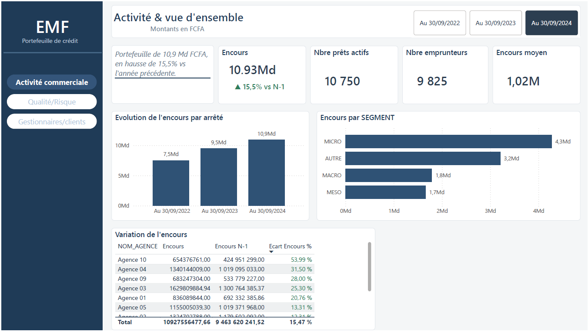
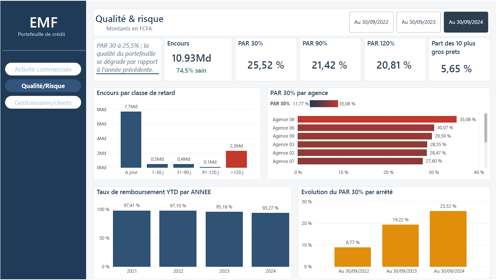
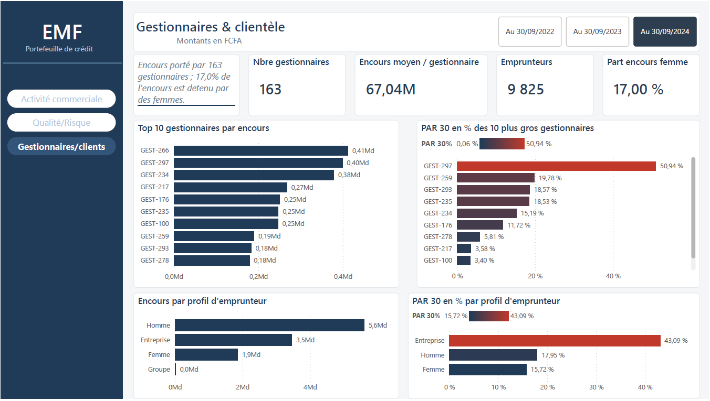
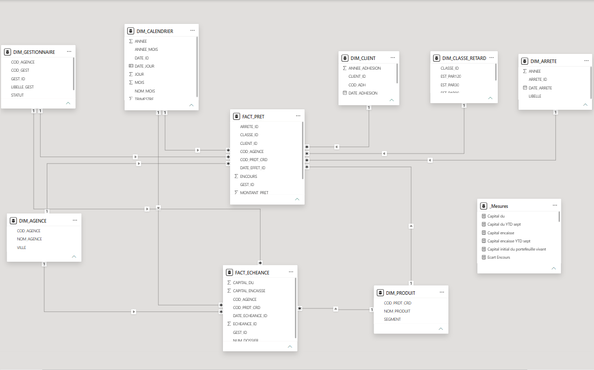

# Analyse de la qualité d'un portefeuille de crédit - Établissement de microfinance (EMF)

Dashboard Power BI de suivi de la **qualité d'un portefeuille de crédit** de microfinance, adossé à un **data mart en étoile** alimenté par **SSIS** depuis une base core banking. Le projet couvre toute la chaîne décisionnelle : de la donnée brute de production jusqu'au tableau de bord de direction.

📄 **Rapport complet (PDF, 3 pages) :** [docs/dashboard_qualite_portefeuille_credit.pdf](docs/dashboard_qualite_portefeuille_credit.pdf)
🔗 **Projet connexe :** [Productivité & mobilisation des ressources (EMF)](https://github.com/Super-237/dashboard-productivite-mobilisation)

> **Message du dashboard :** l'institution développe une activité de crédit dynamique (encours +46 % en deux ans) **mais** voit la qualité de son portefeuille se dégrader nettement (PAR 30 passé de ~9 % à ~25 %). Un cas d'école de la tension **croissance vs qualité**.





---

## Contexte

Les données proviennent du système **core banking de production** d'un **établissement de microfinance (EMF)** d'Afrique centrale (zone CEMAC), un réseau de 11 agences totalisant ~237 000 prêts historiques. L'objectif était de transformer cette base opérationnelle, non pensée pour l'analyse, en un outil de pilotage lisible pour une direction du crédit.

> **Confidentialité :** projet personnel à visée pédagogique. Les données sont **anonymisées** dès la couche ETL (institution, agences, gestionnaires et clients remplacés par des libellés neutres ; aucun nom ni numéro de compte chargé dans le data mart).
>
> La diffusion est **volontairement statique** : le rapport publié ici se limite aux **captures et au PDF**, qui n'exposent que des **agrégats**. Le fichier Power BI (`.pbix`), qui embarque les données au grain du prêt, et les packages SSIS, qui contiennent les chaînes de connexion réelles, sont **exclus du dépôt**.

## Questions métier traitées

- Quelle est la taille et la croissance du portefeuille (encours, nombre de prêts, d'emprunteurs) ?
- Quelle est sa qualité (PAR 30 / 90 / 120), et où le risque se concentre-t-il (agence, produit, ancienneté) ?
- Le portefeuille se compare-t-il favorablement à l'année précédente (N-1) ? Quelles catégories progressent ou reculent ?
- L'institution recouvre-t-elle bien, et la tendance s'améliore-t-elle ?
- Quels gestionnaires et quels profils d'emprunteurs (genre, nature) portent le risque ?

## Architecture

```
CoreBanking_EMF (SQL Server 2019, core banking, prod)
        │   extraction + anonymisation
        ▼
   SSIS (packages .dtsx, idempotents)
        │   chargement en étoile
        ▼
PORTFOLIO_CREDIT_DM (data mart, schéma en étoile)
        │   import
        ▼
   Power BI (modèle + DAX + thème)  ──►  Dashboard 3 pages
```

**Stack :** SQL Server 2019 · SSIS (Visual Studio) · Power BI Desktop · T-SQL · DAX

## Modèle de données (schéma en étoile)

Trois tables de faits, pilotées par des dimensions partagées :

- **`FACT_PRET`** - *snapshot périodique* : une photo du portefeuille vivant à chaque date d'arrêté (30/09 de 2022, 2023, 2024). Grain : 1 ligne par (arrêté, prêt). Porte l'encours, le retard, la classe de retard.
- **`FACT_ECHEANCE`** - *flux* : une ligne par échéance (capital dû / encaissé), pour le taux de remboursement dans le temps.
- **`FACT_DECAISSEMENT`** - *flux de production* : une ligne par crédit mis en place, préparé pour une analyse de cohorte (vintage) par gestionnaire. Modélisé et chargé, non encore exploité dans le rapport (extension prévue).
- **Dimensions** : `DIM_ARRETE`, `DIM_CALENDRIER`, `DIM_AGENCE` (anonymisée), `DIM_GESTIONNAIRE` (anonymisée, avec distinction Commercial / Recouvrement), `DIM_PRODUIT`, `DIM_CLIENT` (anonymisée), `DIM_CLASSE_RETARD`.



## Choix méthodologiques

- **Encours (capital restant dû)** = capital planifié (échéancier) − capital remboursé, recalculé depuis les tables sources plutôt qu'à partir de champs stockés jugés peu fiables.
- **PAR (Portefeuille à Risque)** selon le standard CGAP : dès qu'un prêt a une échéance en retard au-delà du seuil, **tout son encours** est compté à risque (effet de contagion). Seuils 30 / 90 / 120 jours.
- **Date d'arrêté fixée au 30/09** : les données du 4ᵉ trimestre 2024 étant incomplètes, un arrêté au 31/12 aurait gonflé artificiellement le PAR. Le 30/09 donne une photo cohérente.
- **Snapshot périodique** pour le stock (encours, PAR) : un stock ne se reconstruit pas d'une seule photo, on matérialise donc une photo par date d'arrêté. Le flux (remboursement) reste transactionnel et se découpe librement dans le temps.
- **Comparaison N-1** en DAX via un décalage chirurgical de la seule dimension d'arrêté (le contexte de catégorie est préservé).
- **Recouvrement comparé en cumul à date (YTD au 30/09)** pour comparer équitablement une année en cours à l'année précédente.
- **Gestionnaires de recouvrement isolés** : ils héritent des créances dégradées, leur PAR avoisine 100 % par construction. Faute de marqueur natif fiable dans la base, ils sont identifiés par une **règle métier déclarée et documentée**, afin de ne pas fausser la comparaison entre commerciaux.

## Principaux constats

| Indicateur | 2022 | 2023 | 2024 |
|---|---|---|---|
| Encours (Md FCFA) | 7,5 | 9,5 | 10,9 |
| PAR 30 | ~9 % | ~19 % | ~25 % |
| Taux de remboursement (YTD sept.) | 97 % | 95 % | 93 % |

➡️ **Croissance forte, mais qualité en dégradation** : le risque se concentre sur une poche dure de créances à plus de 120 jours et sur certaines agences. Diagnostic nuancé plutôt que simple constat.

La 3ᵉ page (**Gestionnaires & clientèle**) montre que le risque n'est pas uniforme : les **femmes remboursent mieux** (PAR 30 ~16 % contre ~18 % pour les hommes) alors qu'elles ne détiennent que ~17 % de l'encours, et le segment **Entreprise concentre le risque** (PAR 30 ~43 %).

## Limites & périmètre

Un projet honnête assume ce qu'il ne mesure pas :

- **Données arrêtées à fin 2024**, avec un 4ᵉ trimestre incomplet : l'analyse du stock est figée au 30/09, aux trois dates de photo (pas de granularité intra-annuelle sur l'encours ou le PAR).
- **Prêts passés en perte exclus du stock** (encours, PAR) : ils relèvent d'une analyse de pertes et de provisions distincte, préparable à partir de la table source de déclassement (extension future).
- **Taux de remboursement** calculé sur l'ensemble des échéances (y compris celles de prêts finalement radiés) : il intègre donc la perte, ce qui le tire légèrement vers le bas.
- **Classement des gestionnaires en top 10 global** (et non top 5 par agence) : un rang strict par agence exigerait une mesure `RANKX`, réservée à une itération ultérieure.
- **Marqueur de recouvrement déclaré manuellement** : aucune propriété native de la base ne distingue de façon fiable les gestionnaires de recouvrement.

## Structure du dépôt

```
portfolio-credit/
├── sql/
│   ├── 01_create_portfolio_credit_dm.sql   # DDL du data mart (étoile)
│   ├── 02_sources_dimensions.sql           # requêtes source des dimensions (+ anonymisation)
│   ├── 03_sources_faits.sql                # requêtes source des faits
│   └── 04_reset_data_mart.sql              # reset (idempotence)
├── ssis/                                   # extraits C# des tâches de script (projet et packages exclus : chaînes de connexion réelles)
├── powerbi/
│   ├── mesures_dax.dax                     # mesures DAX documentées
│   └── theme_emf.json                      # thème Power BI
├── docs/                                   # captures d'écran (3 pages + modèle) et PDF du rapport
└── README.md
```

## Reproduire

1. Restaurer une base source sur SQL Server, exécuter `sql/01_create_portfolio_credit_dm.sql`.
2. Ouvrir le projet SSIS (`ssis/`), coller les requêtes de `sql/02` et `sql/03` dans les sources, exécuter les packages (dimensions puis faits).
3. Ouvrir le rapport Power BI, actualiser, appliquer `powerbi/theme_emf.json` et créer les mesures de `powerbi/mesures_dax.dax`.

## Compétences démontrées

- Modélisation dimensionnelle (schéma en étoile, snapshot périodique de Kimball)
- ETL avec SSIS (data flows, lookups de clés de substitution, anonymisation, idempotence)
- T-SQL avancé (CTE, fonctions de fenêtrage, logique métier de PAR)
- DAX (contexte de filtre, comparaison N-1, cumuls à date, garde-fous stock/flux)
- Conception de dashboard (storytelling, hiérarchie visuelle, discipline des couleurs)
- Rigueur analytique (validation des hypothèses sur les données, gestion des limites de complétude, distinction corrélation/causalité)

## Contact

**Arnold** - professionnel de la data (10 ans d'expérience IT, dont 5 ans comme DBA et analyste Power BI).

- LinkedIn : [à compléter](https://www.linkedin.com/)
- GitHub : [Super-237](https://github.com/Super-237)
